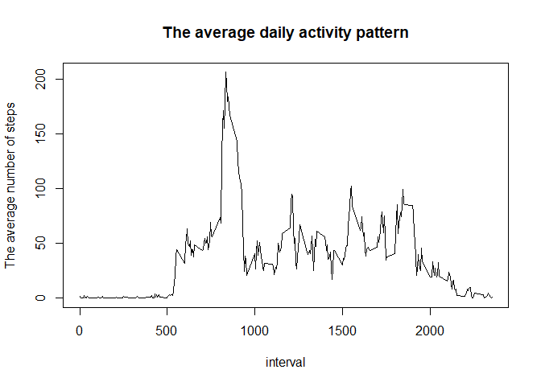

## Introduction

It is now possible to collect a large amount of data about personal movement using activity monitoring devices such as a [Fitbit](https://www.fitbit.com/de/home) or [Nike Fuelband](https://www.nike.com/help/a/why-cant-i-sync). These type of devices are part of the “quantified self” movement – a group of enthusiasts who take measurements about themselves regularly to improve their health, to find patterns in their behavior, or because they are tech geeks. But these data remain under-utilized both because the raw data are hard to obtain and there is a lack of statistical methods and software for processing and interpreting the data.

This assignment makes use of data from a personal activity monitoring device. This device collects data at 5 minute intervals through out the day. The data consists of two months of data from an anonymous individual collected during the months of October and November, 2012 and include the number of steps taken in 5 minute intervals each day.

## Data

The data for this assignment can be downloaded from the course web site [Activity monitoring data](https://d396qusza40orc.cloudfront.net/repdata%2Fdata%2Factivity.zip) [52K]

The variables included in this dataset are:

- **steps**: Number of steps taking in a 5-minute interval (missing values are coded as NA)  
- **date**: The date on which the measurement was taken in YYYY-MM-DD format  
- **interval**: Identifier for the 5-minute interval in which measurement was taken  

The dataset is stored in a comma-separated-value (CSV) file and there are a total of 17,568 observations in this dataset.

## Loading and preprocessing the data

Code for loading data and reading them into R.


```r
if(!file.exists("./activity.zip")){
    zipFileUrl <- "https://d396qusza40orc.cloudfront.net/repdata%2Fdata%2Factivity.zip"
    download.file(zipFileUrl, destfile="activity.zip", mode="wb")
}
unzip(zipfile = "activity.zip")
activity <- read.csv("activity.csv")
head(activity, n=4)
```

```
##   steps       date interval
## 1    NA 2012-10-01        0
## 2    NA 2012-10-01        5
## 3    NA 2012-10-01       10
## 4    NA 2012-10-01       15
```

At this stage of our analysis, there is no need to preprocess the dataset.

## What is mean total number of steps taken per day?

Calculate the total number of steps taken per day and ignore the missing values.


```r
TotalNumberOfStepsEachDay <- aggregate(steps~date, activity, sum,
                                       na.action = na.omit)
head(TotalNumberOfStepsEachDay, n=4)
```

```
##         date steps
## 1 2012-10-02   126
## 2 2012-10-03 11352
## 3 2012-10-04 12116
## 4 2012-10-05 13294
```

Make a histogram.


```r
with(TotalNumberOfStepsEachDay, hist(steps,
                                     main="The total number of steps taken per day"))
```

<!-- -->

Calculate and report the **mean** and **median** total number of steps taken per day.


```r
mean(TotalNumberOfStepsEachDay$steps)
```

```
## [1] 10766.19
```

```r
median(TotalNumberOfStepsEachDay$steps)
```

```
## [1] 10765
```

## What is the average daily activity pattern?

Calculate the average daily activity: the number of steps averaged over all days for each given interval.


```r
AverageDailyActivityPattern <- aggregate(steps~interval, activity, mean,
                                         na.action = na.omit)
head(AverageDailyActivityPattern, n=4)
```

```
##   interval     steps
## 1        0 1.7169811
## 2        5 0.3396226
## 3       10 0.1320755
## 4       15 0.1509434
```

Use the base plotting system to make a time series plot of the 5-minute interval (x-axis) and the average number of steps (y-axis).


```r
with(AverageDailyActivityPattern, plot(interval, steps, type = "l",
                                        ylab="The average number of steps",
                                        main="The average daily activity pattern"))
```

<!-- -->

Which 5-minute interval, on average across all the days in the dataset, contains the maximum number of steps?


```r
attach(AverageDailyActivityPattern)
print(AverageDailyActivityPattern[steps==max(steps),])
```

```
##     interval    steps
## 104      835 206.1698
```

```r
detach()
```

## Imputing missing values

In the source data we have a number of intervals with missing values (coded as NA). Let's see the total number of missing values in the original dataset (i.e. the total number of rows with NA), and where exactly they are located.


```r
sum(is.na(activity))
```

```
## [1] 2304
```


```r
summary(activity)
```

```
##      steps                date          interval     
##  Min.   :  0.00   2012-10-01:  288   Min.   :   0.0  
##  1st Qu.:  0.00   2012-10-02:  288   1st Qu.: 588.8  
##  Median :  0.00   2012-10-03:  288   Median :1177.5  
##  Mean   : 37.38   2012-10-04:  288   Mean   :1177.5  
##  3rd Qu.: 12.00   2012-10-05:  288   3rd Qu.:1766.2  
##  Max.   :806.00   2012-10-06:  288   Max.   :2355.0  
##  NA's   :2304     (Other)   :15840
```

Thus, all missing values are steps at some intervals on some days.

The presence of missing data may introduce bias into some calculations or summaries of the data. Therefore, we want to develop a strategy for filling in all of the missing values in the dataset. 

To do this, we will first select all the missing values to see how they are distributed by days.


```r
activityNA <- subset(activity, is.na(steps))
subset(table(activityNA$date), table(activityNA$date)>0)
```

```
## 
## 2012-10-01 2012-10-08 2012-11-01 2012-11-04 2012-11-09 2012-11-10 
##        288        288        288        288        288        288 
## 2012-11-14 2012-11-30 
##        288        288
```

We can see that the data are missing for eight days. Moreover, in each case, the data are not available for the whole day completely at all intervals. Therefore, to fill in the missing data, we can just using the average number of steps (for each interval) calculated earlier.

Create a new dataset that is equal to the original dataset but with the missing data filled in.


```r
activityNew <- activity
attach(AverageDailyActivityPattern)
for (i in 1:nrow(activityNew)) {
    if(is.na(activityNew$steps[i])) {
        a <- activityNew[i,3]
        b <- AverageDailyActivityPattern[interval==a,2]
        activityNew[i,1] <- b
    }
}
detach()
head(activityNew, n=4)
```

```
##       steps       date interval
## 1 1.7169811 2012-10-01        0
## 2 0.3396226 2012-10-01        5
## 3 0.1320755 2012-10-01       10
## 4 0.1509434 2012-10-01       15
```

Make a histogram of the total number of steps taken each day for the dataset with the missing data filled in.


```r
TotalNumberOfStepsEachDayNew <- aggregate(steps~date, activityNew, sum)
with(TotalNumberOfStepsEachDayNew, hist(steps,
                                        main="The total number of steps taken per day (with added data)"))
```

<!-- -->

Calculate and report the **mean** and **median** total number of steps taken per day. 


```r
summary(TotalNumberOfStepsEachDayNew$steps)
```

```
##    Min. 1st Qu.  Median    Mean 3rd Qu.    Max. 
##      41    9819   10766   10766   12811   21194
```

Do these values differ from the estimates from the first part of the assignment? What is the impact of imputing missing data on the estimates of the total daily number of steps?


```r
MeanMedian <- matrix(c(mean(TotalNumberOfStepsEachDay$steps),
                       mean(TotalNumberOfStepsEachDayNew$steps),
                       median(TotalNumberOfStepsEachDay$steps),
                       median(TotalNumberOfStepsEachDayNew$steps)),
                     nrow=2, ncol=2)
rownames(MeanMedian) <- c("Original Data", "New Data")
colnames(MeanMedian) <- c("Mean", "Median")
MeanMedian
```

```
##                   Mean   Median
## Original Data 10766.19 10765.00
## New Data      10766.19 10766.19
```

We can see that the added values left **mean** unchanged, while **median** became equal to mean.

## Are there differences in activity patterns between weekdays and weekends?

For the weekdays() function we need an object inheriting from class "POSIXt" or "Date".  
Let's check our data.


```r
class(activityNew$date)
```

```
## [1] "factor"
```

Transform the data into a format suitable for our analysis.


```r
activityNew$date <- as.POSIXct(activityNew$date)
class(activityNew$date)
```

```
## [1] "POSIXct" "POSIXt"
```

Create a new factor variable in the dataset with two levels – “weekday” and “weekend” indicating whether a given date is a weekday or weekend day.


```r
activityNew$weekdays <- weekdays(activityNew$date, abbreviate = TRUE)
table(activityNew$weekdays)
```

```
## 
##  Fri  Mon  Sat  Sun  Thu  Tue  Wed 
## 2592 2592 2304 2304 2592 2592 2592
```

```r
activityNew$weekdays <- factor(activityNew$weekdays,
                              levels=c("Sun", "Mon", "Tue", "Wed", "Thu", "Fri", "Sat"),
                              labels=c("weekend","weekday","weekday","weekday","weekday","weekday","weekend"))
table(activityNew$weekdays)
```

```
## 
## weekend weekday 
##    4608   12960
```

For further analysis we can use the dplyr package to group our data by interval and by the type of weekdays.


```r
library(dplyr)
activityNewS <- group_by(activityNew, interval, weekdays) %>%
    summarize(NumberOfSteps = mean(steps))
head(activityNewS)
```

```
## # A tibble: 6 x 3
## # Groups:   interval [3]
##   interval weekdays NumberOfSteps
##      <int> <fct>            <dbl>
## 1        0 weekend         0.215 
## 2        0 weekday         2.25  
## 3        5 weekend         0.0425
## 4        5 weekday         0.445 
## 5       10 weekend         0.0165
## 6       10 weekday         0.173
```

Make a panel plot containing a time series plot of the 5-minute interval (x-axis) and the average number of steps taken, averaged across all weekday days or weekend days (y-axis).


```r
library(lattice)
xyplot(NumberOfSteps ~ interval | weekdays, data = activityNewS,
       layout = c(1, 2), type = "l",
       main = "Number of steps taken per day (weekdays vs weekends)",
       xlab = "Interval",
       ylab = "Number of steps")
```

<!-- -->

